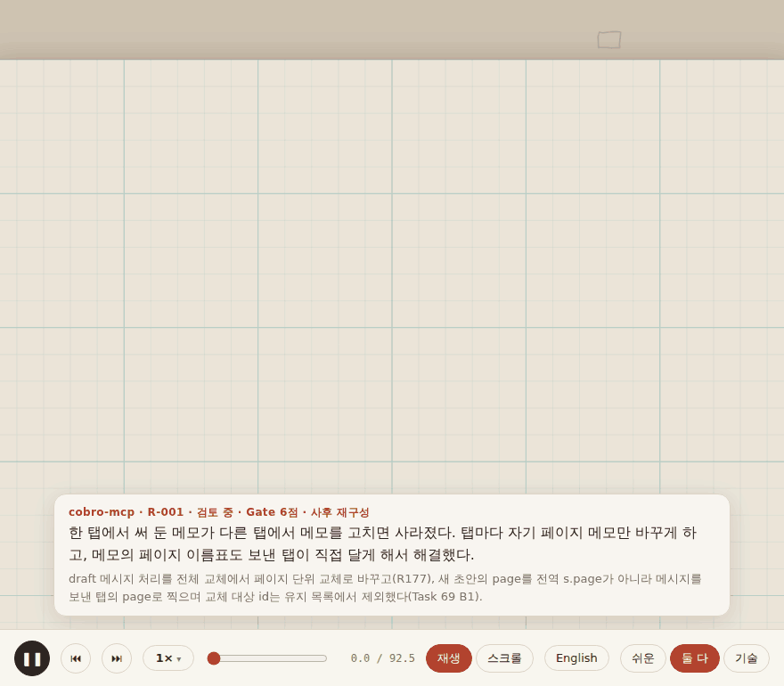

# cobro-recipe

> English: [README.md](README.md)

**해결한 문제를 누구나 읽는 레시피로.**



고친 결과만 남기지 말고, 거기까지 간 길을 남기세요.

cobro-recipe는 Claude Code 스킬이다. 까다로운 문제가 풀리면 그 과정 — **문제 → 시도 → 실패 → 발견 → 해결** — 을 손그림 모션 레시피로 만든다. 장면마다 설명이 두 층이다. 코드를 모르는 사람을 위한 쉬운 말, 개발자를 위한 정확한 기술 설명. 그리고 근거가 된 커밋·테스트 링크가 붙는다. 레시피는 프로젝트에 쌓이고 검색된다("전에 이런 문제 있었나?").

범용이다(웹, ERP, 인프라, 3D …). 처음 쓸 때 프로젝트에서 **도메인 팩**을 추출해, 쉬운 설명이 독자에게 익숙한 비유를 쓰게 한다. 다른 스킬·외부 라이브러리에 의존하지 않고, AI는 작은 YAML 파일만 쓴다 — HTML은 스크립트가 만들어 토큰이 적게 든다.

## 설치

오픈 [skills](https://github.com/vercel-labs/skills) CLI로:

```bash
npx skills add boonblade/cobro-recipe            # 이 프로젝트 → .claude/skills/cobro-recipe
npx skills add boonblade/cobro-recipe -g         # 모든 프로젝트 (사용자 단위)
npx skills update cobro-recipe                   # 나중에 업데이트
npx skills remove cobro-recipe                   # 제거
```

쓰는 에이전트(Claude Code, Cursor, Codex …)를 알아서 찾고(`-a claude-code`로 지정 가능), 출처를 `skills-lock.json`에 기록한다. 직접 설치하려면 `.claude/skills/cobro-recipe/` 폴더를 프로젝트의 `.claude/skills/`(또는 `~/.claude/skills/`)에 복사한다.

Python 3.8+ 필요 — 표준 라이브러리만 쓰고, PyYAML이 있으면 쓴다.

## 빠른 시작

1. 프로젝트에서 Claude Code를 열고 한 번만 설정한다:

   ```
   /cobro-recipe init
   ```

   스킬이 README, 패키지 정보, 폴더 구조, 최근 커밋을 훑어보고 로컬 도메인 팩(`recipes/pack.yaml`)을 제안한다: 프로젝트 이름과 저장소 주소, 언어, 비유를 가져올 곳, 주요 용어 10~20개. 확인하고 승인한다.

2. 평소처럼 문제를 푼다. 여러 번 시도해야 했던 문제면 스킬이 점수(**Gate**)를 매겨 남길지 제안한다 — 강제하지 않는다:

   ```
   📒 레시피 후보: 여러 탭에서 쓴 초안 지키기
   Gate 6점 — S1 시도 2회, S2 원인 층위 다름, S4 여러 탭에서만, S7 재발 가능
   ```

3. 작성한다(지나간 일이면 커밋 범위를 지정해도 된다):

   ```
   /cobro-recipe write 5cc9d99^1..5cc9d99
   ```

   `recipes/R-001-cross-tab-drafts/recipe.yaml`과 `recipe.html`이 생기고 인덱스가 갱신된다.

4. 나중에 비슷한 증상을 만나면:

   ```
   /cobro-recipe search "다른 탭에서 메모가 사라짐"
   ```

## 사용법

| 명령 | 하는 일 |
|---|---|
| `/cobro-recipe init` | 프로젝트 도메인 팩 추출 → `recipes/pack.yaml` |
| `/cobro-recipe write [커밋 범위]` | git 이력·세션으로 레시피 작성 → 검사 → 렌더 → 인덱스 |
| `/cobro-recipe translate <R-###> <ko\|en>` | 요청할 때만 원본 옆에 번역본 작성 (`recipe.<lang>.yaml` / `.html`) |
| `/cobro-recipe search <증상>` | `recipes/INDEX.json`에서 비슷한 레시피 찾기 |
| (자동 제안) | 까다로운 문제를 해결한 직후 Gate 4점 이상이면 레시피화를 제안 |

레시피는 여덟 가지 장면으로 짠다 — 🚩 문제, 🔍 관찰, 🧪 시도, ❌ 실패, 🧠 발견, 🛠 해결, ⚠️ Edge Case, ✅ 검증. 문제·관찰·시도·발견·해결·검증은 항상 들어가고, 실패는 안 된 시도가 있으면 반드시, Edge Case는 필요할 때만 넣는다. 실패한 시도는 일부러 남긴다. "왜 그 방법은 안 됐나"가 대개 가장 값진 부분이다.

## 출력 형식

한 가지: **손그림 모션 레시피** HTML 한 파일. 모눈종이 위를 카메라가 따라가며 장면이 연필로 그려지고, 하단 카드에 쉬운 설명·기술 설명·근거 링크가 나온다. 재생하거나 스크롤하고, 속도(0.5×~2×)를 바꾸고, 장면을 건너뛸 수 있다. 인쇄하거나 스크립트가 꺼져 있으면 일반 문서로 보인다.

장면 배치·시간표·카메라는 템플릿이 레시피 내용에서 계산한다 — HTML을 손으로 쓰는 사람은 없다. 그림은 연필로 그려지는 내장 부품이다: 비교 칸, 표, 코드 카드, 흐름·전후·짝 도식, 이미지.

## 프로젝트와 언어

- **프로젝트** — `init`이 팩에 프로젝트 이름과 저장소 주소를 넣는다. 이름은 첫 화면·설명 카드·서명·인덱스·검색 결과에 나오고, 주소는 근거를 커밋·파일 링크로 만든다.
- **언어** — 레시피 하나는 한 언어(`lang: ko | en`)로 쓴다. 사용자 지정 → 팩 `lang` → 대화 언어 순으로 정하고, 버튼·장면 이름도 따라 바뀐다. 영어 프로젝트는 `packs/general-en.yaml`에서 시작한다.
- **번역본** — 요청할 때만 만든다. 번역 파일은 원본 옆에 두고, 두 HTML은 서로 링크되며, 인덱스에서는 한 줄로 묶이고, 검색은 어느 언어로 해도 걸린다. 검사기는 번역본이 원본과 id·장면·근거가 같은지 확인한다.

## 가볍게 유지하는 방법

- **의존성 없음** — 다른 스킬도, 결과물의 CDN·프레임워크도 없다. 손글씨 폰트(Gaegu)는 온라인일 때만 불러오고, 아니면 시스템 글꼴을 쓴다.
- **AI는 데이터만** — 모델은 `recipe.yaml`만 쓰고, `render.py`가 템플릿으로 HTML을 만든다. 스킬은 지금 단계에 필요한 참조만 읽는다.
- **Gate 먼저** — 레시피감이 아니면 짧은 체크리스트에서 끝난다.
- **캐시** — 팩은 프로젝트당 한 번 추출하고, 검색은 레시피 전부가 아니라 `INDEX.json`만 읽는다.

## 저장소 구성

| 경로 | 내용 |
|---|---|
| [`.claude/skills/cobro-recipe/SKILL.md`](.claude/skills/cobro-recipe/SKILL.md) | 스킬 본체: 원칙, 명령, 절차 |
| [`scripts/`](.claude/skills/cobro-recipe/scripts/) | `validate.py` · `render.py` · `build_index.py` · `search.py` · `recipe_io.py`(내장 YAML 파서) |
| [`templates/`](.claude/skills/cobro-recipe/templates/) | `sketch.html`(손그림 엔진) · `recipe.template.yaml` |
| [`references/`](.claude/skills/cobro-recipe/references/) | Gate 기준 · Scene 타입 · 쉬운 설명 가이드 · 스키마 · 도메인 팩 |
| [`packs/`](.claude/skills/cobro-recipe/packs/) | 내장 팩: `general`(한국어, 기본) · `general-en` · `garment-3d` |
| [`examples/cobro-mcp/`](examples/cobro-mcp/) | [cobro-mcp](https://github.com/boonblade/cobro-mcp) 실전 적용: 추출한 팩, R-001 한국어·영어 |
| [`examples/garment-3d-seam/`](examples/garment-3d-seam/) | `garment-3d` 팩 형식 샘플과 손그림 스타일을 정할 때 만든 수작업 목업 |
| [`docs/`](docs/) | 기획서·설계 메모 |

## 진행 상황

P1 완료: 스킬, 스크립트, 손그림 렌더러, 번역본, cobro-mcp 실전 적용. 다음(P2): 작업 중 시도 기록(capture), 자동 제안 정착, 휴대폰 세로 화면 배치, 여러 영역에서 레시피 추가 검증. [docs/PLAN.md](docs/PLAN.md) 참고.

## 라이선스

[MIT](LICENSE) © 2026 Blade Baek. 스킬 폴더에도 같은 [LICENSE](.claude/skills/cobro-recipe/LICENSE)가 들어 있어 폴더만 복사해도 함께 간다.

- 손글씨 폰트 Gaegu(SIL OFL 1.1)는 포함하지 않는다. 레시피가 온라인일 때 Google Fonts에서 불러온다.
- `examples/cobro-mcp/`의 코드 발췌·커밋·테스트 이름은 [cobro-mcp](https://github.com/boonblade/cobro-mcp)(Apache-2.0)에서 인용했다.
