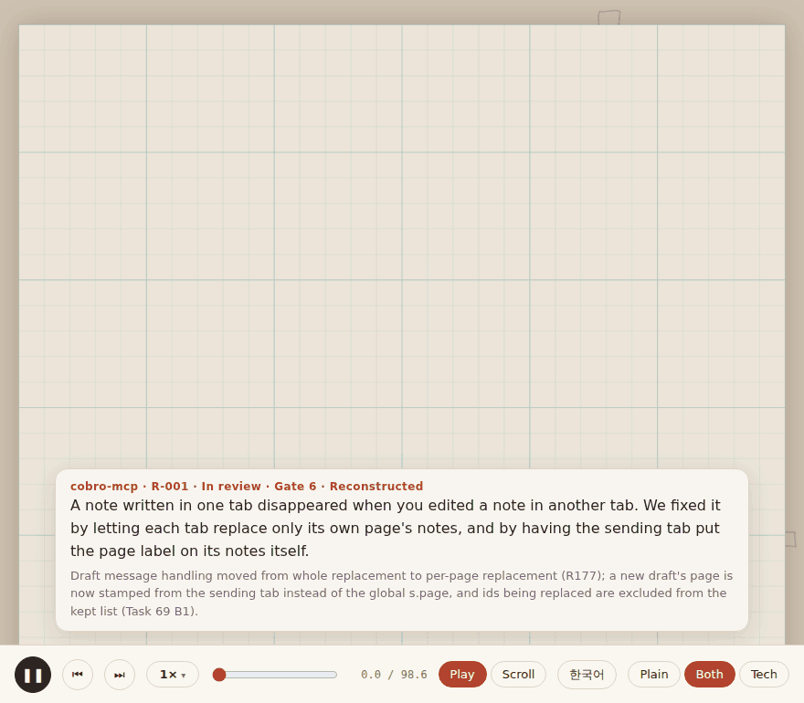

# cobro-recipe

> 한국어: [README.ko.md](README.ko.md)

**Turn the problems you solved into recipes anyone can read.**



Don't just keep the fix. Keep how you got there.

cobro-recipe is a Claude Code skill. When a hard problem finally gets solved, it turns the path — **problem → attempts → failures → discovery → solution** — into a hand-drawn, animated recipe. Each step is explained twice: once in plain words for people who don't read code, once in precise technical terms for developers, with links to the commits and tests that back it up. Recipes pile up in your project and become searchable ("have we seen this before?").

It is general-purpose (web, ERP, infra, 3D, …): on first use it extracts a **domain pack** from your project so the plain explanations use metaphors your readers already know. It depends on no other skill and no external library, and the AI only writes a small YAML file — the HTML is generated by a script, so it stays light on tokens.

## Install

Copy the `.claude/skills/cobro-recipe/` folder into your project's `.claude/skills/` (or `~/.claude/skills/` to use it in every repository).

Requires Python 3.8+ — standard library only; PyYAML is used if present.

## Quick start

1. Open Claude Code in your project and set it up once:

   ```
   /cobro-recipe init
   ```

   The skill samples the README, package metadata, folder layout and recent commits, then proposes a local domain pack (`recipes/pack.yaml`): project name and repository URL, language, whose everyday life to borrow metaphors from, and 10–20 key terms. Review it and approve.

2. Solve a hard problem as usual. When several attempts were needed, the skill scores it (the **Gate**) and suggests — never forces — keeping it:

   ```
   📒 Recipe candidate: Keeping drafts written in several tabs
   Gate 6 — S1 two attempts, S2 root cause in another layer, S4 only with several tabs, S7 likely to recur
   ```

3. Write it (you can also point at a commit range after the fact):

   ```
   /cobro-recipe write 5cc9d99^1..5cc9d99
   ```

   You get `recipes/R-001-cross-tab-drafts/recipe.yaml` and `recipe.html`, and the index is updated.

4. Later, when something looks familiar:

   ```
   /cobro-recipe search "note disappears in another tab"
   ```

## Usage

| Command | What it does |
|---|---|
| `/cobro-recipe init` | Extract the project's domain pack → `recipes/pack.yaml` |
| `/cobro-recipe write [commit range]` | Write a recipe from git history and the session → validate → render → index |
| `/cobro-recipe translate <R-###> <ko\|en>` | On request, write a translation next to the original (`recipe.<lang>.yaml` / `.html`) |
| `/cobro-recipe search <symptom>` | Find similar recipes in `recipes/INDEX.json` |
| (suggestion) | Right after a hard fix, suggests a recipe when the Gate score is 4 or more |

A recipe has eight kinds of scenes — 🚩 problem, 🔍 observe, 🧪 attempt, ❌ fail, 🧠 discovery, 🛠 solution, ⚠️ edge case, ✅ verify. Failed attempts are never dropped: why something didn't work is usually the most valuable part.

## Output

One format: a **hand-drawn motion recipe** in a single HTML file. A camera travels over a sheet of grid paper while each scene is drawn in pencil; a card at the bottom shows the plain and technical explanation and the evidence links. Play or scroll through it, change the speed (0.5×–2×), jump between scenes. When printed or with scripts off it falls back to a plain document.

Scene layout, timing and camera are computed from the recipe by the template — no one hand-writes the HTML. Pictures are built-in parts drawn in pencil: comparison cards, tables, code cards, flow / before-after / pair diagrams, images.

## Projects and languages

- **Project** — `init` stores the project name and repository URL in the pack. The name appears on the title screen, caption, signature, index and search results; the URL turns evidence into commit and file links.
- **Language** — each recipe is written in one language (`lang: ko | en`), chosen by: what you ask for → the pack's `lang` → the language you're chatting in. Buttons and scene names follow it. English projects start from `packs/general-en.yaml`.
- **Translations** — only on request. The translated file sits next to the original, both HTML files link to each other, the index shows them on one row, and search matches either language. The validator checks that the translation keeps the same id, scenes and evidence.

## How it stays light

- **No dependencies** — no other skills, no CDN or framework in the output. The handwriting font (Gaegu) loads only when online; otherwise system fonts are used.
- **AI writes data only** — the model writes `recipe.yaml`; `render.py` builds the HTML from a template. The skill loads only the reference it needs for the current step.
- **Gate first** — if a problem isn't worth a recipe, it stops at a short checklist.
- **Cached** — the pack is extracted once per project; search reads `INDEX.json`, not every recipe.

## Repository layout

| Path | Contents |
|---|---|
| [`.claude/skills/cobro-recipe/SKILL.md`](.claude/skills/cobro-recipe/SKILL.md) | The skill: principles, commands, steps |
| [`scripts/`](.claude/skills/cobro-recipe/scripts/) | `validate.py` · `render.py` · `build_index.py` · `search.py` · `recipe_io.py` (built-in YAML parser) |
| [`templates/`](.claude/skills/cobro-recipe/templates/) | `sketch.html` (hand-drawn engine) · `recipe.template.yaml` |
| [`references/`](.claude/skills/cobro-recipe/references/) | Gate criteria · scene types · plain-language guide · schema · domain packs |
| [`packs/`](.claude/skills/cobro-recipe/packs/) | Built-in packs: `general` (Korean, default) · `general-en` · `garment-3d` |
| [`examples/cobro-mcp/`](examples/cobro-mcp/) | Real run on [cobro-mcp](https://github.com/boonblade/cobro-mcp): extracted pack, R-001 in Korean and English |
| [`docs/`](docs/) | Plan and design notes (Korean) |

## Status

P1 is done: skill, scripts, hand-drawn renderer, translations, and a real-project run on cobro-mcp. Next (P2): capturing attempts while you work, settling the automatic suggestion, a portrait layout for phones, and more recipes to validate across domains. See [docs/PLAN.md](docs/PLAN.md).

## License

[MIT](LICENSE) © 2026 Blade Baek. The skill folder carries its own copy of the [LICENSE](.claude/skills/cobro-recipe/LICENSE), so it travels with the folder.

- The Gaegu font (SIL OFL 1.1) is not bundled; recipes load it from Google Fonts when online.
- Code excerpts, commits and test names in `examples/cobro-mcp/` are quoted from [cobro-mcp](https://github.com/boonblade/cobro-mcp) (Apache-2.0).
